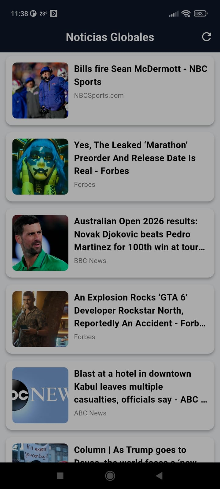

<div align="center">

# 📰 Newsly

**🗞️ Flutter application to explore and read news quickly, with a modern and visually appealing design.**

[](https://flutter.dev/)
[](#-current-status)

</div>

---

## ✨ Introduction and Purpose

**Newsly** is a modern mobile application developed in **Flutter**, designed to showcase elegant design, clean architecture, and efficient state management — all within a practical and engaging use case.

This project serves as a **portfolio app**, demonstrating the integration of **real-time news APIs**, smooth navigation, and a user-friendly interface for exploring the latest headlines from around the world.  

With a focus on **performance, scalability, and clean code practices**, Newsly is an example of how Flutter can be used to build beautiful, responsive, and production-ready mobile experiences.

--- 

## 🚀 Key Features

* **📰 Real-Time News Feed:** Fetches the latest headlines from trusted sources using RESTful APIs.
* **🧭 Intuitive Navigation:** Smooth transitions and organized UI for exploring articles effortlessly.
* **💬 Detailed Article View:** Displays complete information, including images, author, publication date, and full content.
* **🌐 External Links Support:** Open original articles directly in your browser with one tap.
* **⚙️ Clean Architecture:** Built with **Flutter Bloc** and **Equatable** for scalable and maintainable state management.

---

## ⚙️ Technologies and Dependencies

This application is built with **Flutter** and leverages a set of modern, reliable packages to ensure performance, scalability, and clean architecture — optimized for **Android**.

| Dependency | Purpose | Version |
| :--- | :--- | :--- |
| `http` | Handles **REST API requests** to fetch live news data. | `^1.1.0` |
| `flutter_bloc` | Implements **state management** following the BLoC pattern for predictable, testable logic. | `^9.1.1` |
| `equatable` | Simplifies **value comparisons** within BLoC states and events. | `^2.0.5` |
| `intl` | Manages **date and localization formatting** for displaying publication times and metadata. | `^0.18.0` |
| `url_launcher` | Opens **external news links** directly in the system browser. | `^6.1.10` |
| `get_it` | **Service Locator** for dependency injection, decoupling the interface from a concrete implementation. | `^7.6.7` |
| `flutter_dotenv` | Manages **environment variables** securely (e.g., API keys). | `^5.1.0` |
| `cupertino_icons` | Provides **iOS-style icons** for use across the UI (useful for cross-platform or Android styling). | `^1.0.8` |
| `flutter_lints` | Ensures **best coding practices and linting rules** during development. | `^5.0.0` |
| `flutter_launcher_icons` | Tool to **generate app icons** for Android/iOS. | `^0.13.1` |


🧩 **Framework:** [Flutter](https://flutter.dev/)  
📱 **Platform:** Android  
🎯 **SDK Version:** `^3.8.1`  

---

## 🏗️ Project Structure

The project follows a **modular and scalable architecture**, separating presentation, logic, and data layers to maintain clarity and reusability.

| File / Folder | Description |
| :--- | :--- |
| `.env` | **Environment variables file**. Stores sensitive data like API keys. (Not versioned) |
| `lib/main.dart` | The **main entry point** of the application. Initializes Flutter and loads the root widget. |
| `lib/app.dart` | Defines the **app configuration**, including global theme, routes, and initial screen. |
| `lib/core/constants.dart` | Centralized **constants** such as colors, API endpoints, and string values. |
| `lib/core/helpers.dart` | Contains **utility functions** used throughout the app (e.g., date formatting, URL parsing). |
| `lib/data/models/news_article_model.dart` | Defines the **data model** for news articles (title, author, image, source, etc.). |
| `lib/data/repositories/news_repository.dart` | Defines the **repository contract** and implementation to abstract data fetching. |
| `lib/locator.dart` | Configures the **service locator** (`get_it`) for dependency injection. |
| `lib/data/news_api.dart` | Handles **HTTP requests** to fetch news data from external APIs. |
| `lib/blocs/news_cubit.dart` | Implements **state management** using the Cubit pattern for loading and updating articles. |
| `lib/pages/home_page.dart` | The **main screen** displaying the list of news articles fetched from the API. |
| `lib/pages/news_detail_page.dart` | **Detail screen** showing the full content of a selected news article. |
| `lib/widgets/news_card.dart` | **Reusable widget** to display an article preview within lists. |
| `lib/widgets/news_list.dart` | Builds and manages the **list view of news cards** on the home screen. |
| `lib/routes.dart` | Centralized **route configuration** for navigation between pages. |
| `assets/images/` | Folder for **image resources** (placeholders, icons, etc.). |


📁 This structure ensures:
- **Clean separation of concerns** between layers.  
- **Ease of maintenance and scalability** as new features are added.  
- **Readability and modularity**, ideal for collaborative development and portfolio demonstration.

---

## 🚀 Branch Structure and Workflow

The development of **Newsly** follows a simple yet organized workflow to ensure stability, clean version control, and continuous visual and functional improvement.

Below is an overview of the main branches currently used in the project:

| Branch | Type | Purpose | Key Milestones and Implemented Changes |
| :--- | :--- | :--- | :--- |
| **`main`** | **Base / Production** | Represents the most **stable and fully functional** version of the application. All completed features and design improvements are merged here after testing. | Contains the latest integrated version of **Newsly**, ready for demonstration or deployment. |
| **`frontend`** | **UI / Enhancement** | Dedicated to the **user interface development** and visual refinement of the app. | Focused on improving layout, typography, colors, and overall **Flutter UI design** consistency for a polished experience. |


🧩 This branching strategy allows for:
- **Safe development** of new features without affecting stability.  
- **Efficient version control** through clear separation of design and production layers.  
- **Smooth integration** when merging visual updates into the main branch.

---

## 📱 Screenshots

Below are the main screens of **Newsly**, showing its clean and functional interface:

| 🏠 Home | 📄 News Detail | 📄 Another Detail |
| :---: | :---: | :---: |
|  |  |  |

Each screen represents a core part of the user flow:  
- **Home:** Displays the latest top headlines retrieved from the API, allowing users to refresh and browse through current news.  
- **News Detail:** Shows the full content of the selected article, including image, author, publication date, and a direct link to read it on the original site.

---

## 📲 Installation and Setup

There are two main ways to access and use **Newsly**, ensuring both transparency for developers and convenience for end users.

---

### 📦 Option 1: Direct APK Download (For End Users)

If you simply want to install and try the application without setting up a development environment:

1. Navigate to the **`/apk`** directory of this repository.  
2. Download the latest **Newsly .apk** file.  
3. Transfer it to your Android device.  
4. Open the file to install the app (you may need to enable *Install from unknown sources*).  
5. Launch **Newsly** and start exploring the latest news!

---

### 💻 Option 2: Build from Source (For Developers)

If you wish to explore the code, make improvements, or compile the app yourself, follow these steps:

#### ⚙️ Prerequisites
Ensure you have the following tools installed and properly configured:

- **Flutter SDK** (version `3.8.1` or higher, as specified in `pubspec.yaml`)  
- **Dart SDK** (included with Flutter)  
- **Android Studio** or **Visual Studio Code**  
- An Android device or emulator configured for testing  


#### 🛠️ Setup and Build Steps

1. **Clone the Repository**
```
   git clone https://github.com/German1127/newsly.git
   cd newsly
```

2. **Install Dependencies**
```
    flutter pub get
```
3. **Verify Environment**
```
flutter doctor
```
Make sure there are no missing dependencies before continuing.

4. **Run in Development Mode**
```
flutter run
```
This will launch the app on your connected Android device or emulator.
5. **Generate the Production Build (APK)**
```
flutter build apk
```
The compiled binary will be available at:
```
build/app/outputs/flutter-apk/app-release.apk
```
---

## ✅ Current Status

The **Newsly** project is currently in an **Active and Functional** state.

* ✔️ **Core Functionality:** The app successfully retrieves and displays the latest news articles from integrated APIs.
* ✔️ **Navigation and Layout:** Functional navigation flow between main sections (Home, Categories, and Article View).
* ✔️ **Frontend Implementation:** Initial **UI layer** with color scheme, typography, and icon integration for Android.
* ✔️ **Architecture Setup:** Integrated **Flutter BLoC** pattern for clean state management and scalability.
* ✔️ **Deployment Ready:** The app can be compiled and installed via APK, functioning smoothly on Android devices.

---

## 💡 Future Improvements (Roadmap)

We are planning several enhancements and optimizations for upcoming releases to make **Newsly** more powerful, flexible, and user-friendly:

* **🌐 Unlimited News Access:** Replace the current **free-tier API** with a more robust or self-hosted backend solution to remove daily or request-based limitations.
* **📰 Extended Content Loading:** Implement continuous or paginated loading to **display more articles** dynamically without manual refresh.
* **✨ UI/UX Enhancements:** Refine visual elements, animations, and transitions to deliver a **more engaging reading experience** following Material 3 design standards.
* **🔎 Advanced Filtering:** Add category-based and keyword search options to help users **find specific news faster**.
* **⚡ Performance Improvements:** Optimize network requests and caching to **reduce load times** and enhance app responsiveness.
* **📱 Multi-Platform Exploration:** Evaluate the feasibility of bringing **Newsly** to iOS and web platforms.

---

## 🛠️ Technical Challenges Overcome

Although **Newsly** is a lightweight application, some small but important technical challenges were addressed during development:

* **🌐 API Limitations:**  
  The free-tier news API restricts the number of daily requests, which required optimizing how and when data is fetched to avoid unnecessary calls.

* **⚙️ State Management:**  
  Implementing **Cubit** helped keep the app responsive and organized when handling asynchronous requests and dynamic updates.

* **📱 UI Consistency:**  
  Minor adjustments were made to ensure proper layout and readability across different Android screen sizes and resolutions.

---

## ‍💻 Author

Developed with passion by:

* **[German1127]** 💻

*“Stay informed, stay curious.”* 🗞️
